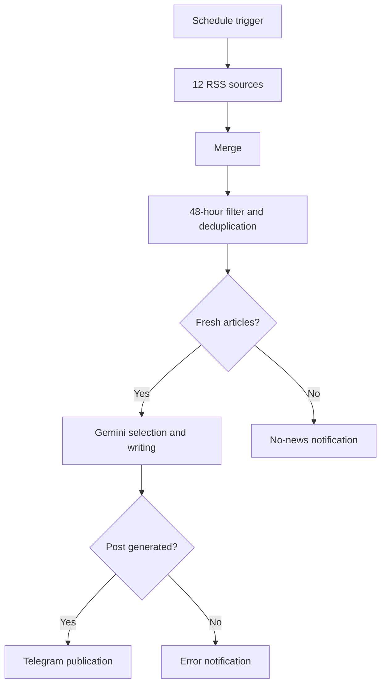

# CyberPulse News Bot

AI-powered n8n workflow that collects esports news from RSS feeds, filters and ranks recent articles, generates a Russian-language Telegram post with Gemini, and publishes it to a channel.

## What the project does

The workflow runs five times a day and:

1. reads news from 12 esports sources through Google News RSS;
2. merges all articles into one stream;
3. keeps only items published within the last 48 hours;
4. prevents duplicate processing for 30 days;
5. scores priority topics, especially CS2 and Dota 2;
6. sends a shortlist to Gemini;
7. generates one concise Russian-language post;
8. publishes the result to Telegram;
9. sends a separate notification when no news is found or generation fails.

## Architecture

## Stack

- n8n
- JavaScript Code nodes
- RSS / Google News RSS
- Google Gemini
- Telegram Bot API
- Prompt engineering

## Key implementation details

- Twelve independent RSS feeds are joined into a single workflow.
- Articles older than 48 hours are discarded.
- Processed URLs are stored in n8n workflow static data for 30 days.
- A scoring system prioritizes major tournaments, teams, players and breaking news.
- Gemini receives a limited shortlist instead of the complete raw feed.
- The workflow contains separate branches for empty results and model errors.
- The public export contains no real tokens, credentials or private Telegram identifiers.

## Import and setup

1. Download `workflows/cyberpulse-news-bot.json`.
2. Open n8n and select **Import from File**.
3. Connect your own Google Gemini credentials.
4. Connect your own Telegram Bot credentials.
5. Replace:
   - `@YOUR_CHANNEL_USERNAME` with the target channel;
   - `@YOUR_PERSONAL_TELEGRAM_ID` with the administrator chat ID.
6. Add the Telegram bot as an administrator of the target channel.
7. Run the workflow manually and inspect every branch.
8. Activate the schedule only after the test succeeds.

## Security

Never commit:

- Telegram bot tokens;
- Gemini API keys;
- n8n credential exports;
- production webhook URLs;
- private chat IDs.

This repository intentionally uses placeholders. Credentials must be configured inside n8n.

## Current limitations

- Article images are not yet extracted.
- Generated captions are not yet limited to 700–950 characters.
- Static workflow data is used for deduplication instead of an external database.
- Human approval is not included before publication.
- Production performance metrics have not yet been collected.

## Planned improvements

- extract the main image from the original article;
- send a Telegram photo with a 700–950 character caption;
- add a fallback when an image is unavailable;
- store publication history in a database;
- add optional human approval;
- track successful, skipped and failed runs.

## Repository contents

- [n8n workflow](workflows/cyberpulse-news-bot.json)
- [Architecture documentation](docs/architecture.md)
- [Example article candidates](examples/article-candidates.json)
- [Example generated post](examples/generated-post.txt)
- [Safe configuration template](.env.example)

## Author

**Lee Daniel** — AI Automation / Full Stack Developer  
Bishkek, Kyrgyzstan
