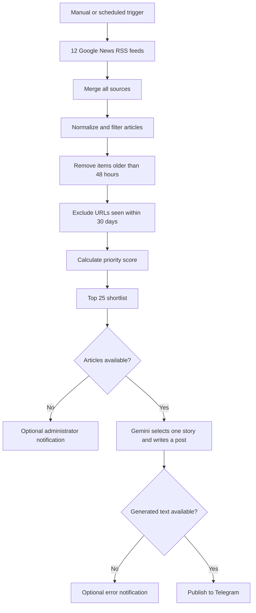

# Architecture

## Purpose

CyberPulse automates the editorial pipeline for a Russian-language esports Telegram channel.

## Data flow

## Components

### Triggers

A manual trigger supports testing. The scheduled trigger runs at 09:00, 12:00, 15:00, 18:00 and 21:00 in the configured n8n timezone.

### RSS ingestion

Twelve Google News RSS queries collect articles from Russian-language and international esports sources. CS2 and Dota 2 are the primary disciplines.

### Filtering and ranking

A JavaScript Code node:

- rejects missing titles and URLs;
- rejects articles older than 48 hours;
- ignores URLs stored in workflow static data;
- gives additional points to priority games, tournaments, teams and players;
- sorts candidates by score and publication time;
- limits the Gemini input to 25 candidates.

### AI generation

Gemini receives structured candidates and must select one story. The prompt requires a Russian post based only on supplied facts, with a source URL at the end.

### Telegram delivery

A successful result is sent to the configured channel. Optional disabled nodes can notify an administrator when there are no articles or when generation fails.

## State

The current version uses n8n global static data for a 30-day URL history. A future version should store publication state in a persistent database and mark an article as published only after Telegram confirms delivery.

## Trust boundaries

- RSS and article metadata are untrusted external input.
- Gemini output must be treated as generated content.
- Telegram and Gemini credentials remain inside n8n.
- Public repository files must contain placeholders only.
